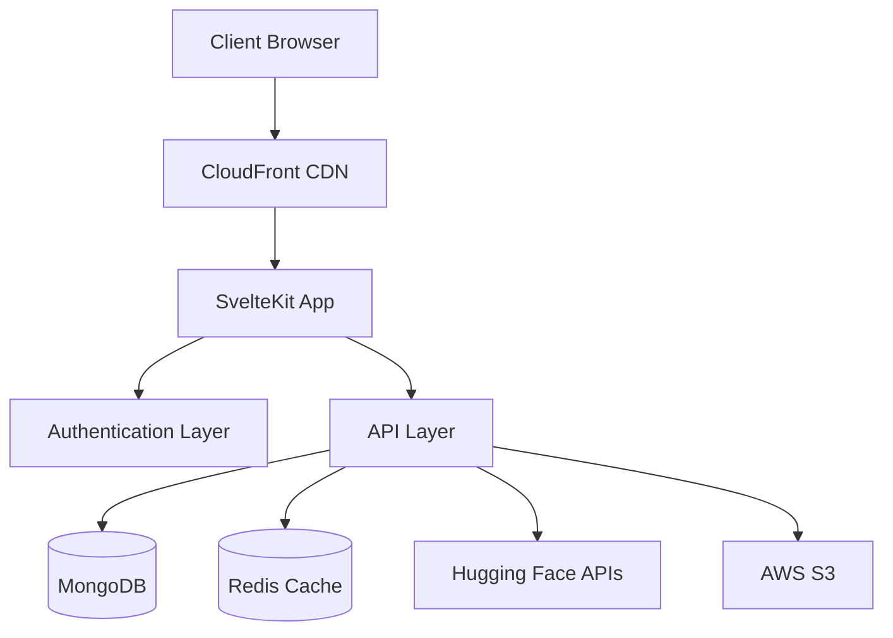

# Hugging Face for Business

## Overview
This project is a machine learning platform designed to provide a business-friendly interface for interacting with machine learning models, repositories, and workflows. The platform leverages **SvelteKit** for both frontend and backend (server-side), **MongoDB** for data storage, and **Hugging Face** for machine learning integration. The infrastructure is hosted on **AWS**, ensuring scalability, security, and reliability.

## Architecture

### Technical Stack
- **Frontend & Backend:** SvelteKit (full-stack framework)
  - Server-side API routes for backend functionality
  - Server-side rendering (SSR) for improved SEO and performance
  - WebSocket integration for real-time monitoring
- **Database:** MongoDB
  - Document store for flexible model metadata
  - Time-series collections for metrics storage
  - Redis caching layer for performance optimization
- **Infrastructure:** AWS
  - ECS with Fargate for containerized deployment
  - S3 for model artifact storage
  - CloudFront CDN for global content delivery
  - CloudWatch for logging and monitoring
- **ML Integration:** Hugging Face
  - Inference API for model predictions
  - Model Hub API for repository browsing
  - Spaces API for deployment options

### System Architecture


## MVP Features

### 1. **User Authentication**
- **Sign-up, Login, and Profile Management:** Users can create accounts, log in, and manage their profiles.
- **Authentication:** JWT-based authentication with refresh token rotation
- **Security:** 
  - Rate limiting on API endpoints
  - CSRF protection
  - Secure session management

### 2. **Model Browsing and Search**
- **Model Repository:** Users can browse and search machine learning models from Hugging Face's ML Hub.
- **Search Functionality:** 
  - Real-time search with debouncing
  - Advanced filtering options
  - Cached search results
  - Pagination support

### 3. **Model Deployment and Inference**
- **Model Deployment:** 
  - One-click deployment to AWS Lambda or Hugging Face Spaces
  - Automatic scaling configuration
  - Version management
- **Inference API:** 
  - REST API endpoints for model inference
  - Batch prediction support
  - Request/Response validation
  - Error handling and retry logic

### 4. **Monitoring and Analytics**
- **Basic Monitoring:** 
  - Real-time performance metrics via WebSocket
  - Latency tracking
  - Error rate monitoring
  - Resource utilization metrics
- **Usage Analytics:** 
  - Detailed logs with structured data
  - Custom dashboard with filterable metrics
  - Export functionality for reports

## Getting Started

### Prerequisites
- Node.js (v18 or higher)
- MongoDB (v6.0 or higher)
- Redis (v7.0 or higher)
- AWS Account with appropriate IAM permissions
- Hugging Face API Key

### Development Environment Setup
1. **Clone the Repository:**
   ```bash
   git clone https://github.com/guillearria/huggingface-for-business.git
   cd huggingface-for-business
   ```

2. **Install Dependencies:**
   ```bash
   npm install
   ```

3. **Set Up Local Services:**
   ```bash
   # Start MongoDB and Redis using Docker
   docker-compose up -d
   ```

4. **Set Up Environment Variables:**
   Create a `.env` file in the root directory:
   ```env
   # App
   PUBLIC_APP_URL=http://localhost:3000
   NODE_ENV=development

   # Database
   MONGODB_URI=mongodb://localhost:27017/hf-business
   REDIS_URL=redis://localhost:6379

   # Authentication
   JWT_SECRET=your-jwt-secret
   JWT_REFRESH_SECRET=your-refresh-secret
   
   # External Services
   HUGGING_FACE_API_KEY=your-hugging-face-api-key
   
   # AWS (for production)
   AWS_REGION=us-east-1
   AWS_ACCESS_KEY_ID=your-aws-access-key-id
   AWS_SECRET_ACCESS_KEY=your-aws-secret-access-key
   ```

5. **Run Development Server:**
   ```bash
   # Start development server with hot reload
   npm run dev
   ```

6. **Access the Application:**
   Open your browser and navigate to `http://localhost:3000`

### Production Deployment
1. **Build the Application:**
   ```bash
   npm run build
   ```

2. **Deploy to AWS:**
   ```bash
   # Using AWS CDK or similar IaC tool
   npm run deploy
   ```

## Future Developments

### 1. **Collaboration Tools**
- **Forking and Pull Requests:** Allow users to fork models and submit pull requests for collaboration.
- **Role-Based Access Control:** Implement role-based access control for teams and organizations.

### 2. **Advanced Model Management**
- **Model Training:** Integrate with AWS SageMaker for advanced model training.
- **Version Control:** Implement version control for models to track changes and updates.

### 3. **Enhanced Monitoring and Analytics**
- **Advanced Metrics:** Provide more detailed metrics and analytics for model performance.
- **Alerting System:** Implement an alerting system for model performance issues.

### 4. **User Interface Improvements**
- **Dashboard:** Create a comprehensive dashboard for users to manage models, deployments, and analytics.
- **Customizable Views:** Allow users to customize their views and preferences.

### 5. **Integration with Additional Services**
- **Other ML Hubs:** Integrate with other machine learning hubs and services.
- **Third-Party APIs:** Add support for third-party APIs and services.

### 6. **Scalability and Performance Enhancements**
- **Serverless Architecture:** Further leverage AWS Lambda for serverless functions.
- **Global CDN:** Enhance global content delivery using AWS CloudFront.

## Contributing
Contributions are welcome and appreciated. Please follow these steps to contribute:
1. Fork the repository.
2. Create a new branch for your feature or bug fix.
3. Commit your changes.
4. Submit a pull request.

## License
This project is licensed under the MIT License. See the [LICENSE](LICENSE) file for details.

## Contact
For any questions or support, please connect with Guillermo Arria-Devoe on [LinkedIn](https://www.linkedin.com/in/guillearria/).